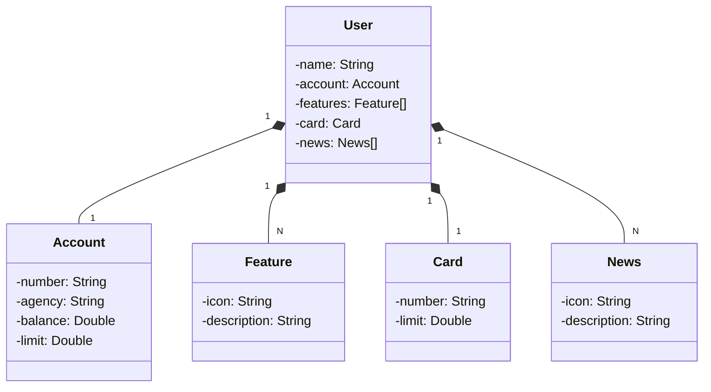

### Projeto desenvolvido como parte do desafio de projeto "Publicando sua API REST na nuvem usando Spring Boot 3, Java 17 e Railway" do Santander Bootcamp 2023 - Fullstack Java+Angular.

Diagrama de classes da aplicação criado a partir do ChatGPT:

Para o desenvolvimento, utilizei as aulas do desafio como base e como melhoria implementei as funcionalidades que permitem a exclusão de usuários por ID, edição por ID e listagem de todos os usuários, resultando em uma implementação básica do CRUD.

Swagger da api: https://java-desafiodio-apirest.up.railway.app/swagger-ui/index.html
